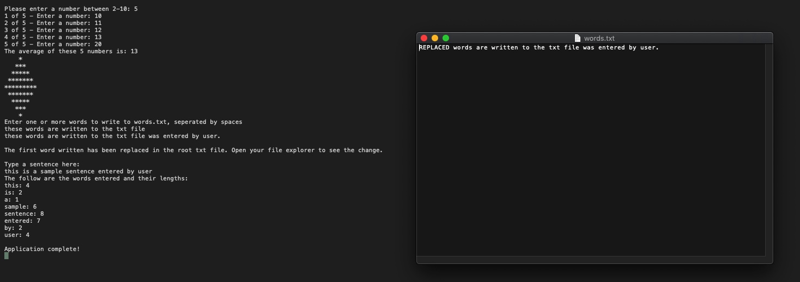

# Lab03-SystemIO

## SystemIO

*Author: Enrique Hilst*

----

## Description
This is a C# console application that will perform a list of tasks. Some of the methods request inputs and complet tasks based on the user's inputs, and others
are only written to pass tests located in `ChallengeTests.cs`.
---

### Getting Started
Clone this repository to your local machine.

```
$ git clone https://github.com/ehilst515/Lab03-SystemIO.git
```

### To run the program from Visual Studio:
Select ```File``` -> ```Open``` -> ```Project/Solution```

Next navigate to the location you cloned the Repository.

Double click on the ```Lab03-SystemIO``` directory.

Then select and open ```Lab03.sln```.

Create the text file `words.txt` in the root of your directory, and update the path with the location of this file.

Run the projects and open the console.

---

### Visuals

